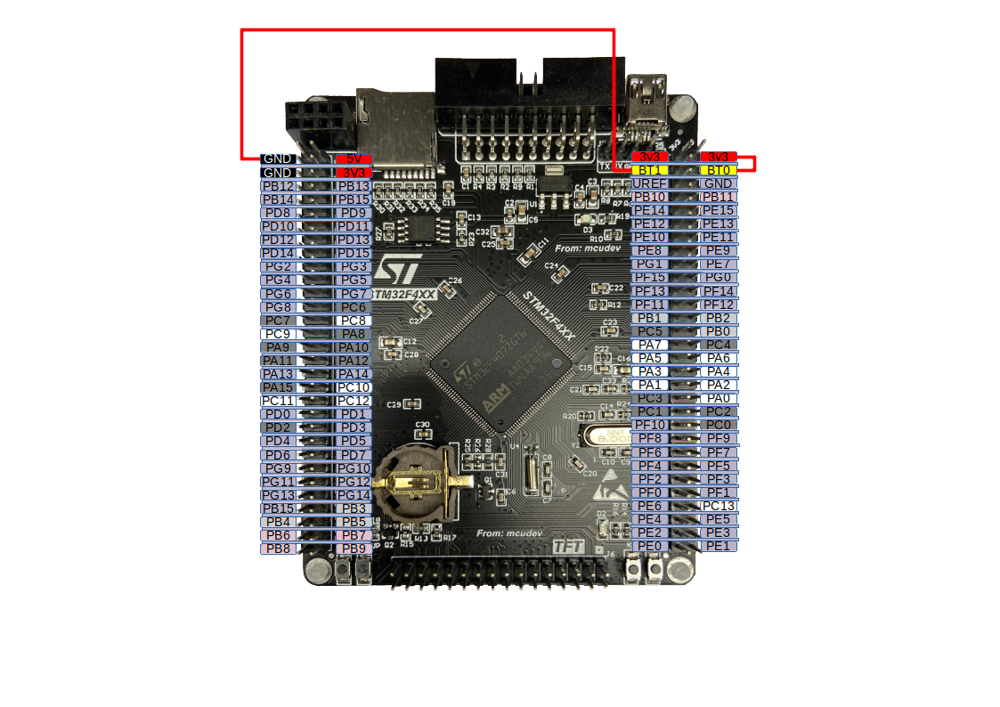
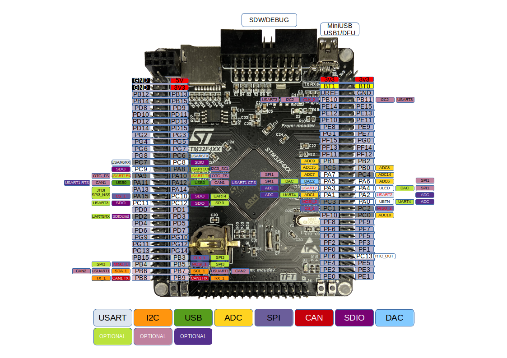
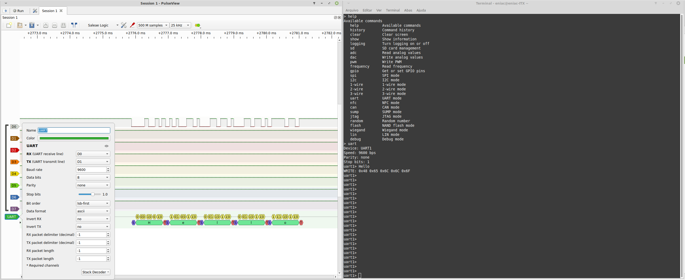
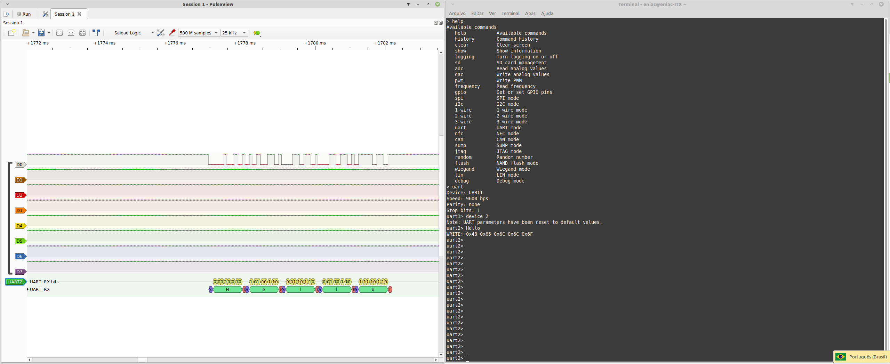
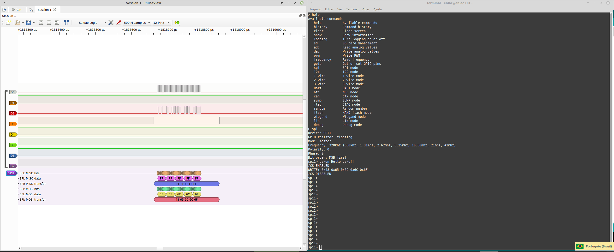
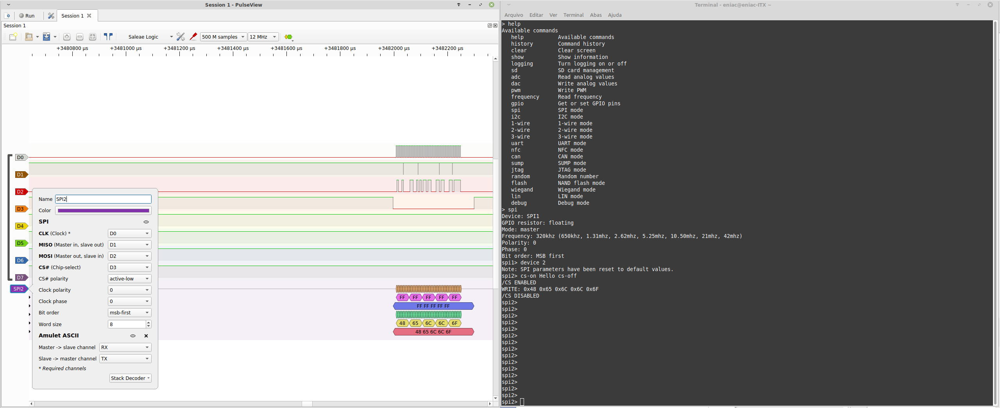

Utilizando PCB STM32F4XX (STM32F407ZGT6) como hospedeiro do firmware https://github.com/hydrabus/hydrafw/releases/tag/v0.9-beta (última versão disponível neste momento).

Atençâo: Conteúdo meramente educacional. Siga este este tutorial por conta e risco. Não há qualquer suporte.

### 1. Ferrametas necessárias para seguir este tutoria

PCB STM32F4XX (STM32F407ZGT6):
https://pt.aliexpress.com/item/4000088929750.html

Analisador lógico:
https://pt.aliexpress.com/item/4000364877295.html

### 2. Windows

- Faça download de última release: https://github.com/hydrabus/hydrafw/releases/latest
- Extraia o arquivo .zip
- Faça os dois jumpers "pino BOOT0 conectado ao pino 3V3" e o "pino BOOT1 conectado ao GND" com mostrado na figura abaixo. Isto irá habilitar o USB DFU para upload do firmware do Hydrabus.



- Conecte o conector MiniUSB na placa e USB ao PC.
- Execute o arquivo "update_fw_usb_dfu_hydrafw.bat" do arquivo descompactado.
- Aguarde a subida do firmware.
- Pronto sua placa já está com o novo firmware.

### 3. Comandos

Acesse o link abaixo e veja os comandos disponíveis:

https://github.com/hydrabus/hydrafw/wiki/HydraFW-console-commands

Os comandos são similares ao do Pirate Bus http://dangerousprototypes.com/docs/Bus_Pirate.

### 4. Pinagem da placa

Abaixo segue pinout da placa STM32F4XX (STM32F407ZGT6):



### 5. Modo de uso

Para os testes você irá precisar de um analisador lógico como este abaixo:

https://pt.aliexpress.com/item/4000364877295.html

- Faça o download da última release do programa PulseView de acordo com o seu Sistema Operacional:

https://sigrok.org/wiki/Downloads

Plugue o analisador lógico na MiniUSB e os canais CH1 e CH2 nos terminais PA9 e PA10 respectivamente.

## 5.1 Windows

- Abaixe o programa putty https://www.chiark.greenend.org.uk/~sgtatham/putty/latest.html
- Execute o programa putty com 
- Conecte o conector MiniUSB na placa e USB ao PC.


## 5.2 Linux

- Execute no terminal

```sh
$ sudo screen /dev/ttyACM0
```

- Caso deseje você pode conectar de outras formas:

Acesse o link https://www.cyberciti.biz/hardware/5-linux-unix-commands-for-connecting-to-the-serial-console/ para encontra a maneira que mais lhe agrada.

## 5.3 UART

```sh
> help
Available commands
   help           Available commands
   history        Command history
   clear          Clear screen
   show           Show information
   logging        Turn logging on or off
   sd             SD card management
   adc            Read analog values
   dac            Write analog values
   pwm            Write PWM
   frequency      Read frequency
   gpio           Get or set GPIO pins
   spi            SPI mode
   i2c            I2C mode
   1-wire         1-wire mode
   2-wire         2-wire mode
   3-wire         3-wire mode
   uart           UART mode
   nfc            NFC mode
   can            CAN mode
   sump           SUMP mode
   jtag           JTAG mode
   random         Random number
   flash          NAND flash mode
   wiegand        Wiegand mode
   lin            LIN mode
   debug          Debug mode
> uart
Device: UART1
Speed: 9600 bps
Parity: none
Stop bits: 1
```
Antes de digitar o próximo comando vá até o PulseView e mude o sample para "500 M samples" e 25 kHz. Com isto você terá tempo capturar os dados vindos da placa.

Do lado do sample mude o protocolo para UART. Uma nova linha será apresentada no programa.

Clique na tag UART no canto esquerdo da tela 

No programa PulseView aperte a barra de espaço para começar a monitorar os canais.

Rapidamente mude para o terminal e execute o comando dentro do terminal do HydraFW:

```
uart1> Hello
```

Volte para a tela do PulseView e veja a captura da palavra "Hello".





Para os demais protocolos siga a configurção realizada no print screen abaixo. Do lado esquerdo está a configuração utilizada pelo PulseView e do lado direito a do HydraFW. Para qualquer dúvida sobre os possíveis comandos https://github.com/hydrabus/hydrafw/wiki/HydraFW-console-commands

## 5.4 SPI





## 5.5 I2C

A fazer

### 6. TODO

- [x] Testar subida do firmware para STM32F4XX
- [x] Criar imagem com a pinagem da placa
- [x] Navegar pela lista do comandos
  - [x] Testar pinagem para os modos UART1 e UART2
  - [x] Testar pinagem para modo SPI e SPI2
  - [ ] Testar pinagem para modo I2C
  
### 7. Mais informações
  
  https://github.com/hydrabus/hydrafw/wiki
