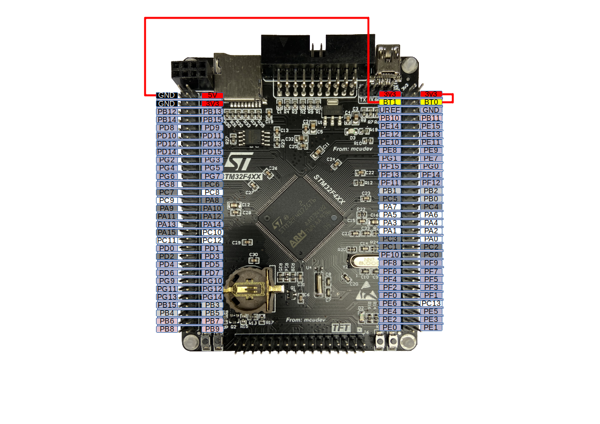
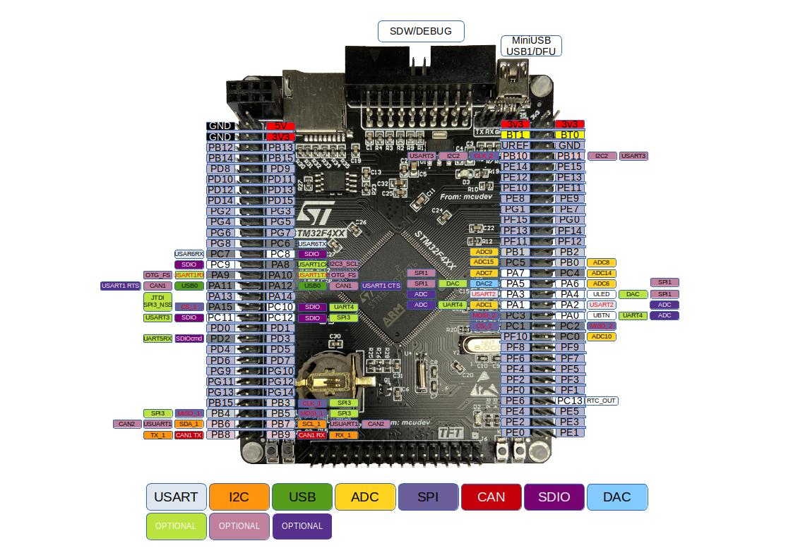
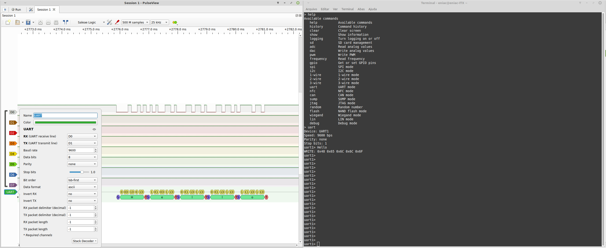
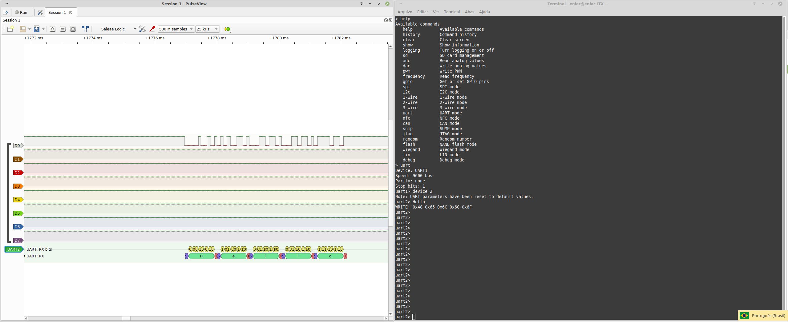
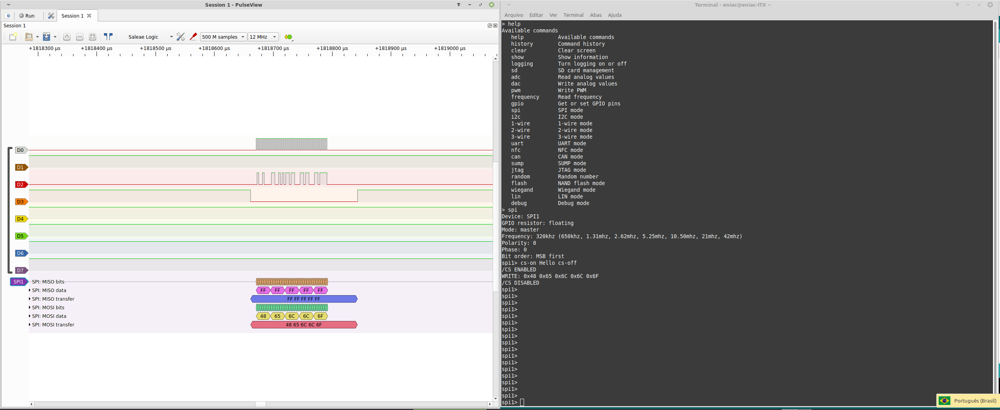
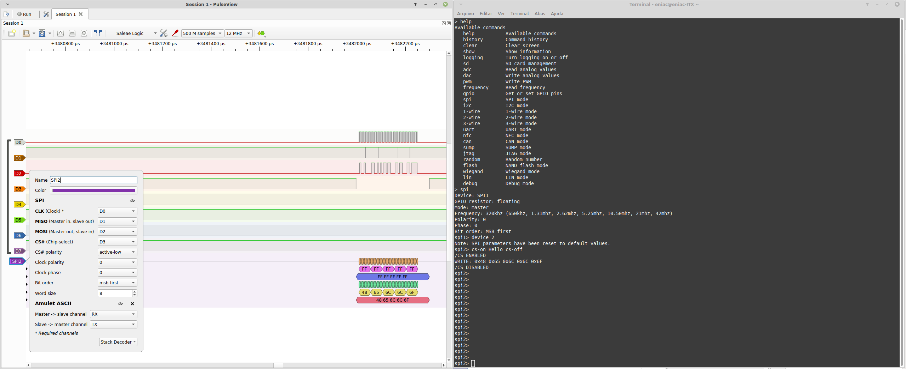

Using the STM32F4XX PCB (STM32F407ZGT6) as the host for the firmware https://github.com/hydrabus/hydrafw/releases/tag/v0.9-beta (latest version available at the time of writing).

Warning: This content is for educational purposes only. Follow this tutorial at your own risk. There is no support of any kind.

### 1. Required Tools

STM32F4XX PCB (STM32F407ZGT6):
https://pt.aliexpress.com/item/4000088929750.html

Logic analyzer:
https://pt.aliexpress.com/item/4000364877295.html

### 2. Windows

- Download the latest release: https://github.com/hydrabus/hydrafw/releases/latest
- Extract the `.zip` file
- Set the two jumpers, "BOOT0 pin connected to 3V3" and "BOOT1 pin connected to GND", as shown in the figure below. This will enable USB DFU for uploading the Hydrabus firmware.



- Connect the MiniUSB connector to the board and connect USB to the PC.
- Run the `update_fw_usb_dfu_hydrafw.bat` file from the extracted archive.
- Wait for the firmware upload to finish.
- Your board is now running the new firmware.

### 3. Commands

Open the link below and check the available commands:

https://github.com/hydrabus/hydrafw/wiki/HydraFW-console-commands

The commands are similar to those of the Bus Pirate:

http://dangerousprototypes.com/docs/Bus_Pirate

### 4. Board Pinout

Below is the pinout for the STM32F4XX board (STM32F407ZGT6):



### 5. Usage

For the tests, you will need a logic analyzer like the one below:

https://pt.aliexpress.com/item/4000364877295.html

Download the latest PulseView release for your operating system:

https://sigrok.org/wiki/Downloads

## 5.1 Windows

- Download PuTTY: https://www.chiark.greenend.org.uk/~sgtatham/putty/latest.html
- Run PuTTY
- Connect the MiniUSB connector to the board and USB to the PC.


## 5.2 Linux

- Run this in the terminal:

```sh
$ sudo screen /dev/ttyACM0
```

- If you want, you can connect in other ways:

Open https://www.cyberciti.biz/hardware/5-linux-unix-commands-for-connecting-to-the-serial-console/ to find the method you prefer.

## 5.3 UART

```sh
> help
Available commands
   help           Available commands
   history        Command history
   clear          Clear screen
   show           Show information
   logging        Turn logging on or off
   sd             SD card management
   adc            Read analog values
   dac            Write analog values
   pwm            Write PWM
   frequency      Read frequency
   gpio           Get or set GPIO pins
   spi            SPI mode
   i2c            I2C mode
   1-wire         1-wire mode
   2-wire         2-wire mode
   3-wire         3-wire mode
   uart           UART mode
   nfc            NFC mode
   can            CAN mode
   sump           SUMP mode
   jtag           JTAG mode
   random         Random number
   flash          NAND flash mode
   wiegand        Wiegand mode
   lin            LIN mode
   debug          Debug mode
> uart
Device: UART1
Speed: 9600 bps
Parity: none
Stop bits: 1
```

Plug the logic analyzer into the MiniUSB port and connect channels CH1 and CH2 to PA9 and PA10, respectively.

Before typing the next command, go to PulseView and set the sample rate to "500 M samples" and 25 kHz. This will give you enough time to capture the data coming from the board.

Change the protocol to UART in the sample settings. A new line will appear in the program.

Click the UART tag on the left side of the screen.

In PulseView, press the space bar to start monitoring the channels.

Quickly switch to the terminal and run the command inside the HydraFW terminal:

```sh
uart1> Hello
```

Go back to PulseView and look at the capture of the word "Hello".





For the other protocols, follow the configuration shown in the screenshot below. The left side shows the PulseView configuration and the right side shows the HydraFW configuration. If you have any questions about the available commands, see https://github.com/hydrabus/hydrafw/wiki/HydraFW-console-commands

## 5.4 SPI





## 5.5 I2C

To do

### 6. TODO

- [x] Test firmware upload to STM32F4XX
- [x] Create an image with the board pinout
- [x] Browse the command list
  - [x] Test pinout for UART1 and UART2 modes
  - [x] Test pinout for SPI and SPI2 modes
  - [ ] Test pinout for I2C mode

### 7. More information

https://github.com/hydrabus/hydrafw/wiki
